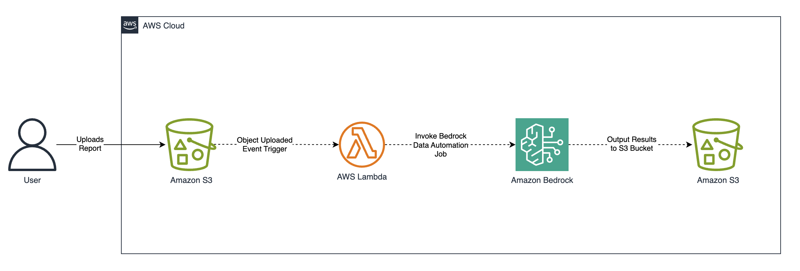

# Energy Well Reports Processing with Amazon Bedrock Data Automation

This project demonstrates how to leverage Bedrock Data Automation to extract insights from energy well reports. The solution provides both a comprehensive walkthrough notebook and infrastructure code to help jumpstart processing various document types commonly found in the energy sector.

## Architecture Overview



The solution includes:
- **S3 Bucket**: Storage for document uploads 
- **Lambda Function**: Docker-based function invokes the Bedrock Data Automation job
- **Event Trigger**: Automatic processing when files are uploaded to the S3 bucket
- **IAM Roles**: Least-privilege permissions for Bedrock and S3 access
- **CloudWatch**: Monitoring and logging for Lambda function for processing reports

## Project Structure

```
23-Energy-Well-Reports/
├── 23-Energy_Well_Reports.ipynb   # Interactive walkthrough notebook
├── infra/                         # AWS CDK infrastructure code
├── services/                      # Lambda function source code
├── data/                         # Sample well reports and blueprints
├── assets/                       # Documentation assets
├── scripts/                      # Utility scripts
├── deploy.sh                     # One-click deployment script
└── README.md                     # This file
```

## Prerequisites

Before getting started, ensure you have:

1. **AWS CLI** configured with appropriate permissions
   ```bash
   aws configure
   ```

2. **UV Package Manager** (recommended for Python dependency management)
   
   ```bash
   # Install UV using pip
   pip install uv
   
   # Or using Homebrew on macOS
   brew install uv
   ```

3. **Node.js** (for AWS CDK)
   ```bash
   # Install Node.js from https://nodejs.org/ or use:
   brew install node  # macOS
   ```

4. **Docker** running locally
   ```bash
   docker --version
   ```

5. **Python 3.12+**
   ```bash
   python3 --version
   ```

## Getting Started

### Interactive Notebook (Recommended for Learning)

Start with the interactive Jupyter notebook to understand the concepts:

1. **Set up Python environment using uv**
   ```bash
   # Install Python
   uv python install 3.12

   # Create virtual environment
   uv venv --python 3.12
   
   # Activate the virtual environment
   source .venv/bin/activate  # On macOS/Linux
   # or
   .venv\Scripts\activate     # On Windows
   
   # Install dependencies
   uv sync
   
   # Install development dependencies (includes Jupyter)
   uv pip install -e .[dev]
   ```

2. **Launch Jupyter notebook**
   ```bash
   jupyter notebook 23-Energy_Well_Reports.ipynb
   ```

3. **Follow the notebook walkthrough** to understand:
   - Bedrock Data Automation overview
   - Document processing workflows
   - Blueprint creation and customization
   - Result analysis

### Infrastructure Deployment

For deployment, use the automated deployment script:

1. **Set up Python environment**
   ```bash
   # Create and activate virtual environment
   uv venv
   source .venv/bin/activate
   
   # Install CDK dependencies
   uv sync --group infra
   ```

2. **Make CDK deployment script executable and run**
   ```bash
   chmod +x build_push.sh
   ./build_push.sh
   ```

   This script will:
   - Build the Docker image for the Lambda function
   - Push the Docker image to Amazon ECR

3. **Make CDK deployment script executable and run**
   ```bash
   chmod +x deploy.sh
   ./deploy.sh
   ```

   This script will:
   - Bootstrap CDK in your AWS account
   - Synthesize the infrastructure stack
   - Deploy the infrastructure stack

4. **Configure Bedrock Data Automation**
   
   After deployment, set up your BDA project:
   ```bash
   # Test BDA connectivity
   python test.py
   
   # This will list available BDA projects
   # Update Lambda environment variables with your project ARN
   ```

